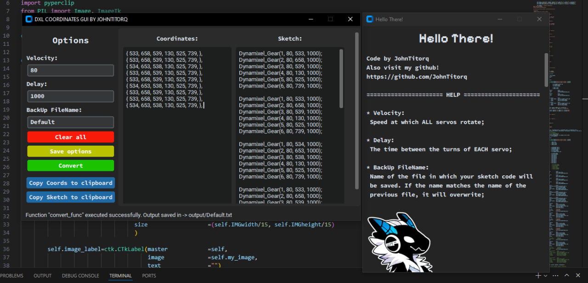

# Dynamixel-Coord-to-Sketch

## Convert the data array obtained from the "ReadCoordinates" example into a sketch.



# 🇺🇸 **English:**

### The program was developed to facilitate the playback of recorded Dynamixel servo positions 
(DYNAMIXEL AX-12W was used for the tests).

Sketch examples have been created for the **OpenCM 9.04** microcontroller, but they can be used
for Dynamixel-compatible controllers like **DXL-IOT** and more with ease.

For correct operation of the program run this command in the project root folder:
```
pip install -r requirements.txt
```

Beginnig, ensure all fonts used in the program are displayed correctly by installing them from the **/Fonts** folder.

After that, execute the program:
```
python . \cords_to_sketch_dxl.py
```
Or use any other way you want;

After receiving the data array with recorded servo positions using the Sketch **"/DynamixelExamples/ReadCoordinates.ino"**,
we insert them into the **"Coordinates"** field of the program I proposed **"cords_to_sketch_dxl.py"**. You can set the speed of
all servos in the field **"Velocity"**, the time between movements in the field **"Delay"**, as well as the name of the file in
which the code for the program will be saved. Then open the Sketch **"/DynamixelExamples/DynamixelGear.ino"** and paste the
resulting code into the function **"void loop()"**, or into any other function you want to use. Don’t forget to change the
value of **"NServos"** to the 5th line of the Sketch, which is responsible for the number of servo drives. For more detailed
instructions on how to get servo coordinates, you can contact the official channel **"Applied Robotics"** on YouTube
(@appliedrobotics1038).

# 🇷🇺 **Russian:**

### Программа создана для упрощения работы с воспроизведением записанных позиций сервоприводов Dynamixel
(в тестах использовались DYNAMIXEL AX-12W).

Скетчи-примеры написаны для микроконтроллера **OpenCM 9.04**, но их легко можно адаптировать и под другие
Dynamixel-совместимые контроллеры, такие как **DXL-IOT** и другие.

Для корректной работы программы выполните команду в корневой папке проекта:
```
pip install -r requirements.txt
```

Для того, чтобы все используемые в программе шрифты отображались корректно, перед запуском установите шрифты из папки **/Fonts**.

Далее запустите программу:
```
python .\cords_to_sketch_dxl.py
```
Либо используйте любой другой способ, который вам будет удобен;

После получения массива данных с записанными позициями сервоприводов с помощью Скетча **"/DynamixelExamples/ReadCoordinates.ino"**
вставим их в поле **"Coordinates"** предложенной мною программы **"cords_to_sketch_dxl.py"**. Вы можете выставить скорость всех сервоприводов
в поле **"Velocity"**, промежуток времени между движениями в поле **"Delay"**, а так же имя файла, в который дополнительно сохранится код для
программы. После этого откройте Скетч **"/DynamixelExamples/DynamixelGear.ino"** и вставьте полученный код в функцию **"void loop()"**, или же
в любую другую функцию, которую хотите использовать. Так же не забудьте поменять значение **"NServos"** на 5-й строке Скетча, отвечающую
за количество сервоприводов. Для более подробных инструкций, как получить координаты сервоприводов, вы можете обратиться на официальный
канал **"Applied Robotics"** на YouTube (@appliedrobotics1038).
